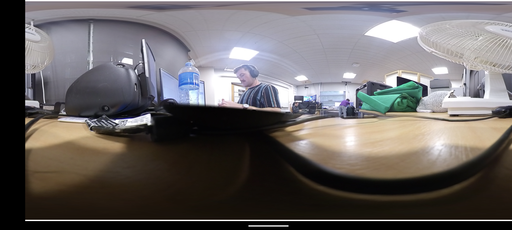

Work in progress editing Insta360 android app. Have edited the app with a new Unity activity **Unity Stream** which is hardcoded to access the highest stream of the Insta360 X and X2. Need a way to send this stream into https://github.com/Luka-Didham/Virtual-Tourism-Camera-Client as currently just grabs the device camera. We can also connect via a Laptop however the Insta360 products are optimised for mobile use through the developer app. To get a fresh unmodified version of the developer app follow https://www.insta360.com/sdk/home and apply for the IOS and Android apps.  

