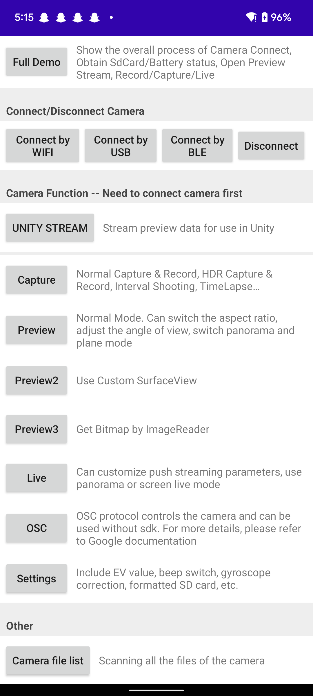

Work in progress editing Insta360 android app. Have edited the app with a new Unity activity **Unity Stream** which is hardcoded to access the highest stream of the Insta360 X and X2. Need a way to send this stream into https://github.com/Luka-Didham/Virtual-Tourism-Camera-Client as currently just grabs the device camera. 

